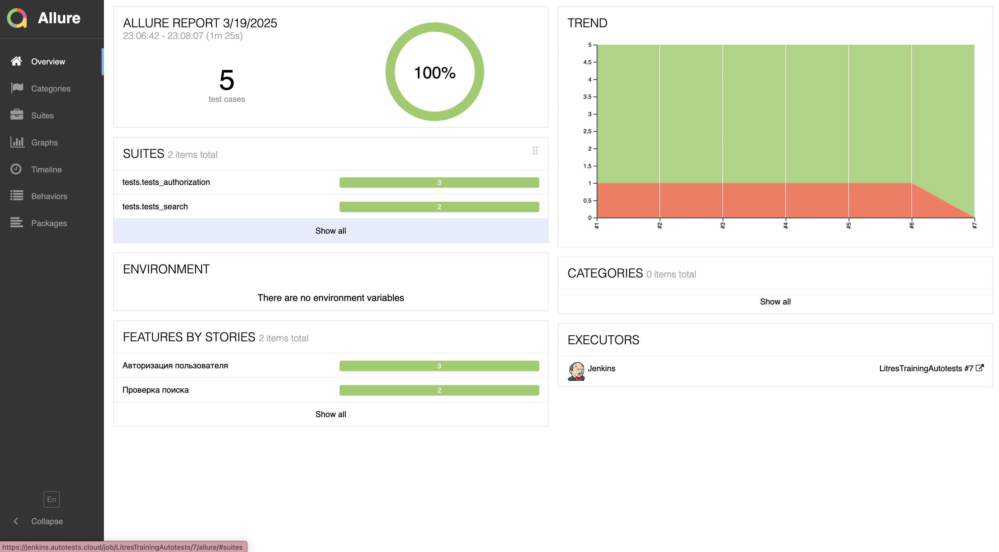
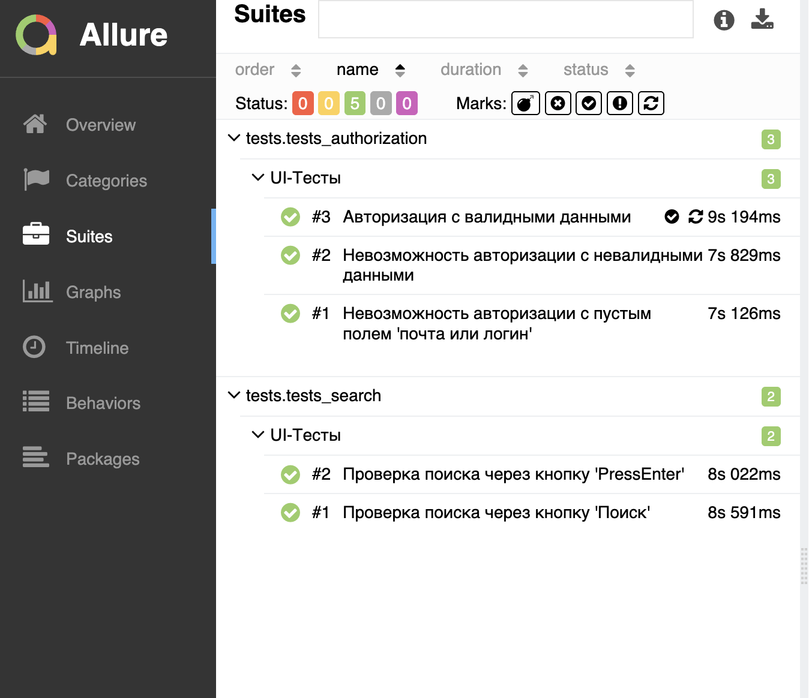
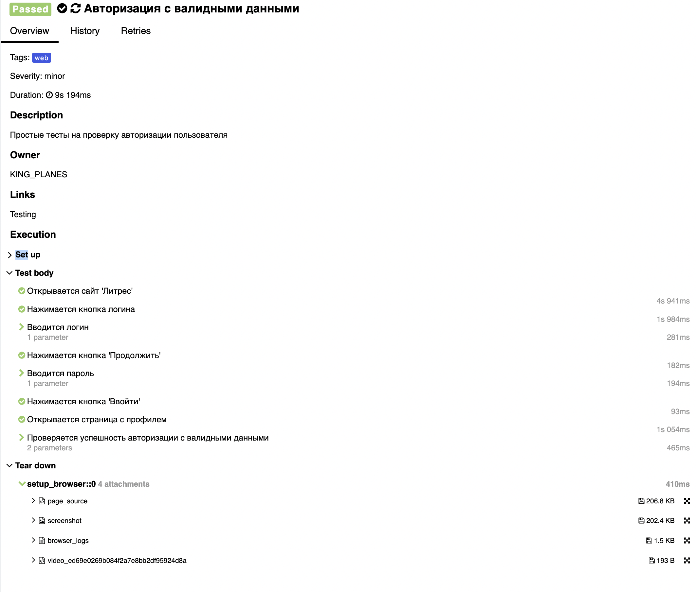
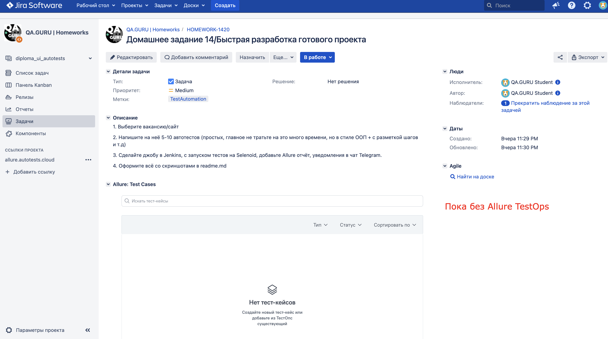
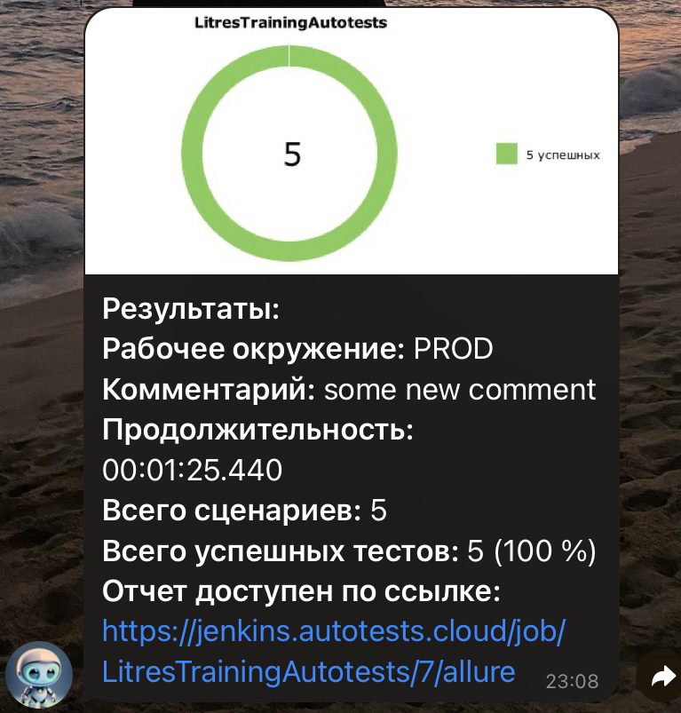
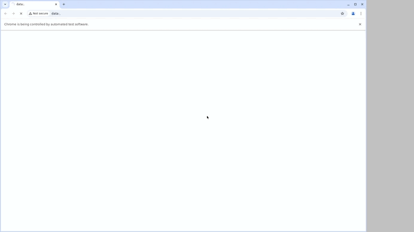

<h1> Проект по тестированию сервиса электронных и аудиокниг "Литрес"</h1>

> <a target="_blank" href="https://www.litres.ru">Ссылка на сайт</a>


<h3> Список проверок, реализованных в автотестах:</h3>

### UI-тесты
- [x] Авторизация пользователя на сайте(успешная и неуспешная)
- [x] Поиск по клику кнопки Поиск/по нажатию PressEnter

----
### Проект реализован с использованием:
         

----
### Локальный запуск
> Для локального запуска с дефолтными значениями необходимо выполнить команду:
```
python -m venv .venv
source .venv/bin/activate
pip install -r requirements.txt
pytest tests
```

----
### Удаленный запуск автотестов выполняется на сервере Jenkins
> <a target="_blank" href="https://jenkins.autotests.cloud/job/LitresTrainingAutotests/">Ссылка на проект в Jenkins</a>

#### Параметры сборки

* `COMMENT` - комментарий
* `BROWSER_VERSION` - версия браузера


#### Для запуска автотестов в Jenkins

1. Открыть <a target="_blank" href="https://jenkins.autotests.cloud/job/LitresTrainingAutotests/">проект</a>
2. Выбрать пункт `Build with Parameters`
3. Указать браузер
4. Указать комментарий
5. Нажать кнопку `Build`
6. Результат запуска сборки можно посмотреть в отчёте Allure
7. 
----
### Allure отчет


#### Общие результаты

#### Список тест кейсов

#### Пример отчета о прохождении ui-теста


----

### Интеграция с Jira
> <a target="_blank" href="https://jira.autotests.cloud/browse/HOMEWORK-1420">Ссылка на проект в Jira</a>



----
### Оповещение о результатах прогона тестов в Telegram

----
### Пример видео прохождения ui-автотеста


