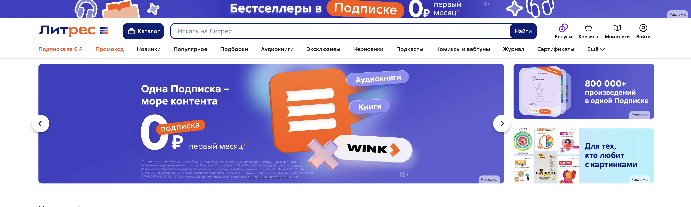

<h1> Проект по тестированию сервиса электронных и аудиокниг "Литрес"</h1>

> <a target="_blank" href="https://www.litres.ru">Ссылка на сайт</a>



<h3> Список проверок, реализованных в автотестах:</h3>

### UI-тесты
- [x] Авторизация пользователя на сайте c валидными данными(Успешная)
- [x] Авторизация пользователя на сайте c невалидными данными(Неуспешная)
- [x] Поиск по клику на кнопку Поиск
- [x] Поиск по нажатию PressEnter на клавиатуре
- [x] Добавление книги в корзину
- [x] Проверка наличия всех разделов/категорий в каталоге

### API-тесты
- [x] Идентификация пользователя по логину
- [x] Добавление книги в "Избранное"
- [x] Удаление книги из "Избранного"
- [x] Поиск книги по названию
- [x] Добавление книги в корзину

### MOBILE-тесты
- [x] Авторизация пользователя в приложении c валидными данными(Успешная)
- [x] Авторизация пользователя в приложении c невалидными данными(Неуспешная)
- [x] Поиск книги по названию


----
### Проект реализован с использованием:
          

----
### Локальный запуск
> Для локального запуска с дефолтными значениями необходимо выполнить команду:
```
python -m venv .venv
source .venv/bin/activate
pip install -r requirements.txt
pytest tests
```
> Для получения отчета необходимо выполнить команду:
```
allure serve allure-results
```
----
### Удаленный запуск автотестов выполняется на сервере Jenkins
> <a target="_blank" href="https://jenkins.autotests.cloud/job/LitresTrainingAutotests/">Ссылка на проект в Jenkins</a>

#### Параметры сборки:
1.`TESTS_TYPE`:

  - [x] tests
  - [x] tests/api
  - [x] tests/web
  - [x] tests/mobile

2.`COMMENT`(необязательный)

#### Для запуска автотестов в Jenkins

1. Открыть <a target="_blank" href="https://jenkins.autotests.cloud/job/LitresTrainingAutotests/">проект</a>
2. Выбрать пункт `Build with Parameters`
3. Выбрать `TESTS_TYPE`(по умолчанию выбран `tests` и будут запускаться все тесты)
4. Указать комментарий(необязательно)
5. Нажать кнопку `Build`
6. Результат запуска сборки можно посмотреть в отчёте Allure
----
### Allure отчет:

#### После прохождения тестов, будет доступен отчет

#### Общие результаты

#### Список тест кейсов

#### Пример отчета о прохождении ui-тестов

#### Пример отчета о прохождении api-тестов

#### Пример отчета о прохождении mobile-тестов


----
### Оповещение о результатах прогона тестов в Telegram

----
### Пример видео прохождения ui-тестов


### Пример видео прохождения mobile-тестов


